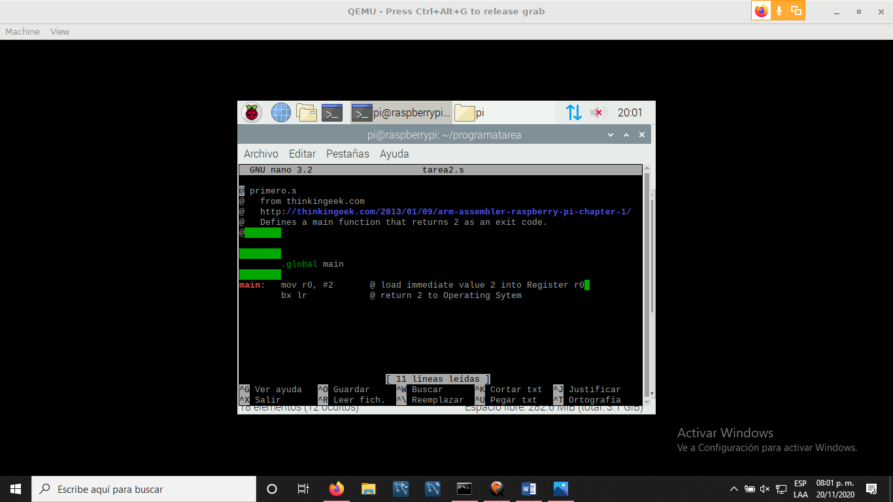
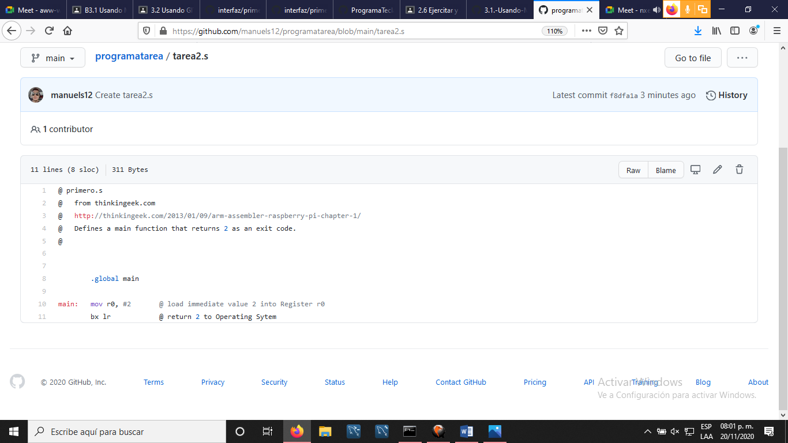
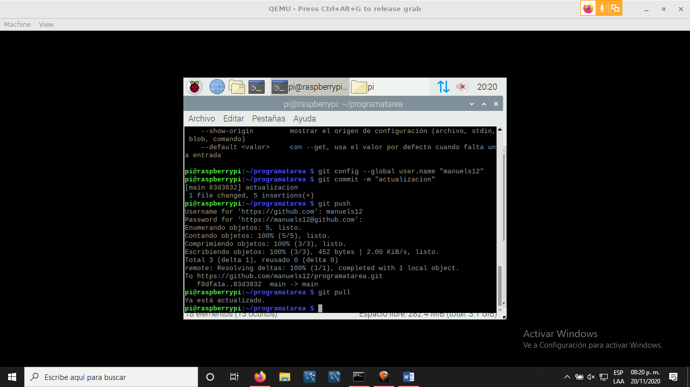
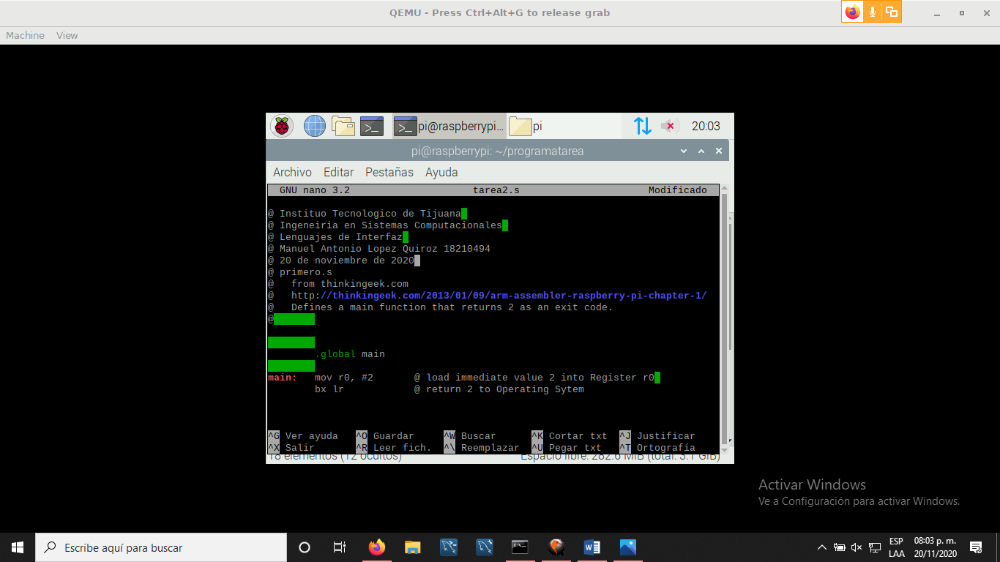
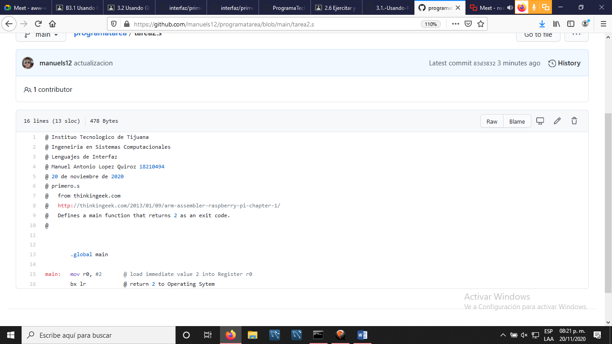

# 3.2. Usando GITHub CLI para subir archivos desde la RPI (o cualquier otro cliente) por comandos. 
* * *
En este programa en QEMU se utilizo el siguiente codigo: 
~~~
@ primero.s
@   from thinkingeek.com
@   http://thinkingeek.com/2013/01/09/arm-assembler-raspberry-pi-chapter-1/
@   Defines a main function that returns 2 as an exit code.
@	

	
	.global main
	
main:   mov r0, #2       @ load immediate value 2 into Register r0 
	bx lr            @ return 2 to Operating Sytem
  
  ~~~
  
El cual usamos como ejemplo para sincronizarnos con el repositorio en tiempo real   
* * *
Aqui se clona el archivo de github.  

* * *
Este es el archivo de github que se clona

* * *

* * *
Aqui agregamos datos

* * *
Aqui ya se muestra la actualizacion en github.

* * *
